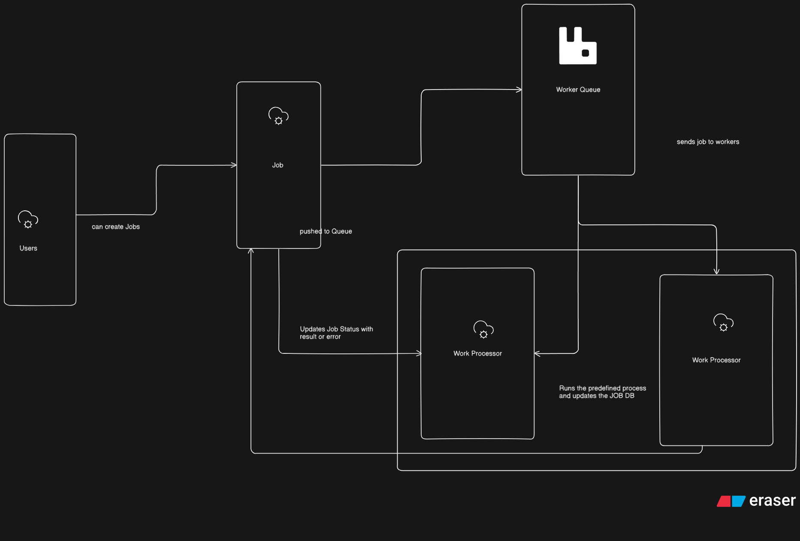

# Job Queue Processor 

## Project Structure

```
job-queue-processor/
├── user-service/          
│   ├── src/
│   │    ├──app.js
│   │    ├──...
│   │    └── token.utils.js
│   ├── Dockerfile
│   ├── .env
│   └── package.json
├── job-service/           
│   ├── src/
│   │   ├──app.js
│   │   ├── ...
│   │   ├── rabbitmq.js      
│   │   └── publisher.js
│   ├── Dockerfile
│   ├── .env
│   └── package.json
├── worker-service/        
│   ├── worker.js
│   ├── package.json
│   ├── Dockerfile
│   └── .env
├── docker-compose.yml
└── README.md
```
## Architecture/Design


## Quick Start

### 1. Clone and Setup

```bash
 git clone https://github.com/Tushar-k-minny/queue-assignment `file-path`
```

### 2. Install Dependencies

**User Service (add RabbitMQ dependency):**
```bash
cd user-service
pnpm install 
```

**Job Service (add RabbitMQ dependency):**
```bash
cd job-service
pnpm install 
```

**Worker Service:**
```bash
cd worker-service
pnpm install
```


### 3. Start the System

**Using Docker Compose (Recommended):**
```bash
# Start all services
docker-compose up -d

# View logs
docker-compose logs -f

# Check service health
docker-compose ps
```

**Without Docker:**
```bash
# Terminal 1: Start RabbitMQ
docker run -d --name rabbitmq -p 5672:5672 -p 15672:15672 rabbitmq:3.12-management-alpine

# Terminal 2: Start PostgreSQL
docker run -d --name postgres -p 5432:5432 -e POSTGRES_PASSWORD=jobpassword postgres:15-alpine

# Terminal 3: Start Auth Service
cd user-service
pnpm dev

# Terminal 4: Start Job Service
cd job-service
pnpm dev

# Terminal 5: Start Worker Service
cd worker-service
pnpm dev
```

## Testing the System

### 1. Register a User

```bash
curl -X POST http://localhost:5001/auth/register \
  -H "Content-Type: application/json" \
  -d '{
    "email": "test@example.com",
    "password": "password123",
    "name": "Test User"
  }'
```

### 2. Login

```bash
curl -X POST http://localhost:5001/auth/login \
  -H "Content-Type: application/json" \
  -d '{
    "email": "test@example.com",
    "password": "password123"
  }'

# Save the token from response
export TOKEN="your-jwt-token-here"
```

### 3. Submit a Job

```bash
# Reverse string job
curl -X POST http://localhost:5002/jobs \
  -H "Content-Type: application/json" \
  -H "Authorization: Bearer $TOKEN" \
  -d '{
    "type": "reverse_string",
    "payload": "hello world"
  }'

# Response:
# {
#   "jobId": "123e4567-e89b-12d3-a456-426614174000",
#   "status": "QUEUED",
#   "type": "reverse_string",
#   "created_at": "2025-01-15T10:30:00Z"
# }
```

### 4. Check Job Status

```bash
# Replace JOB_ID with the ID from previous response
curl http://localhost:5002/jobs/JOB_ID \
  -H "Authorization: Bearer $TOKEN"

# Response:
# {
#   "id": "123e4567-e89b-12d3-a456-426614174000",
#   "type": "reverse_string",
#   "status": "COMPLETED",
#   "result": "dlrow olleh",
#   "error": null,
#   "created_at": "2025-01-15T10:30:00Z",
#   "updated_at": "2025-01-15T10:30:05Z"
# }
```

### 5. List All Jobs

```bash
curl "http://localhost:5002/jobs" \
  -H "Authorization: Bearer $TOKEN"
```

### 6. Test Other Job Types

```bash
# Uppercase text
curl -X POST http://localhost:5002/jobs \
  -H "Content-Type: application/json" \
  -H "Authorization: Bearer $TOKEN" \
  -d '{
    "type": "uppercase_text",
    "payload": "hello world"
  }'

# Fibonacci calculation
curl -X POST http://localhost:5002/jobs \
  -H "Content-Type: application/json" \
  -H "Authorization: Bearer $TOKEN" \
  -d '{
    "type": "fibonacci_calc",
    "payload": 10
  }'
```

## Monitoring

### RabbitMQ Management UI
```
URL: http://localhost:15672
Username: guest
Password: guest
```

Check:
- Queue depth
- Message rate
- Consumer count

### View Worker Logs
```bash
# Docker
docker-compose logs -f worker-service

# Or
docker logs -f job-worker
```


## Scaling Workers

### Scale with Docker Compose
```bash
# Scale to 5 workers
docker-compose up -d --scale worker-service=5

# Check running workers
docker-compose ps worker-service
```

### Manual Scaling
```bash
# Start multiple worker instances
cd worker-service
npm start  # Terminal 1
npm start  # Terminal 2
npm start  # Terminal 3
```

## Troubleshooting

### Worker Not Processing Jobs

**Check RabbitMQ Connection:**
```bash
# View worker logs
docker logs job-worker

# Check RabbitMQ is running
docker ps | grep rabbitmq

# Test connection
curl http://localhost:15672/api/overview -u guest:guest
```

**Check Queue:**
```bash
# Using RabbitMQ CLI
docker exec job-rabbitmq rabbitmqctl list_queues

# Using API
curl http://localhost:15672/api/queues -u guest:guest | jq
```

### Jobs Stuck in QUEUED

1. **Verify worker is running:**
   ```bash
   docker ps | grep worker
   ```

2. **Check worker logs for errors:**
   ```bash
   docker logs job-worker
   ```

3. **Verify queue name matches:**
   - Job Service: `RABBITMQ_QUEUE=job_queue`
   - Worker Service: `RABBITMQ_QUEUE=job_queue`

### Jobs Not Updating Status

1. **Check Job Service URL in worker:**
   ```bash
   # Should be accessible from worker container
   docker exec job-worker wget -O- http://job-service:5002/healthz
   ```

2. **Verify database connection:**
   ```bash
   docker exec job-postgres pg_isready -U jobuser
   ```

3. **Check job service logs:**
   ```bash
   docker logs job-service
   ```

### Connection Refused Errors

**If worker can't connect to RabbitMQ:**
```bash
# Wait for RabbitMQ to be ready
docker-compose up -d rabbitmq
sleep 10
docker-compose up -d worker-service
```

**If worker can't reach Job Service:**
```bash
# Ensure both services are on the same network
docker network inspect job-queue-processor_job-network
```

## Performance Tuning

### Increase Throughput

1. **Scale workers:**
   ```bash
   docker-compose up -d --scale worker-service=10
   ```

2. **Increase prefetch:**
   ```env
   PREFETCH_COUNT=5  # Process 5 messages concurrently per worker
   ```

3. **Optimize job processing:**
   - Keep job logic simple and fast
   - Offload heavy computations
   - Use caching for repeated operations


## Adding New Job Types

1. **Update worker processor:**
   ```javascript
   // In worker.js
   static myNewProcessor(payload) {
     // Your logic here
     return result;
   }
   ```

2. **Update database constraint:**
   ```sql
   ALTER TABLE jobs DROP CONSTRAINT check_type;
   ALTER TABLE jobs ADD CONSTRAINT check_type 
   CHECK (type IN ('reverse_string', 'uppercase_text', 'fibonacci_calc', 'my_new_type'));
   ```

3. **Update job service validation:**
   ```javascript
   const validTypes = [...existingTypes, 'my_new_type'];
   ```

## Production Checklist

- [ ] Change default passwords (RabbitMQ, PostgreSQL)
- [ ] Use strong JWT secrets
- [ ] Enable SSL/TLS for all connections
- [ ] Set up proper logging (Winston, Bunyan)
- [ ] Add monitoring (Prometheus + Grafana)
- [ ] Implement rate limiting
- [ ] Set up dead letter queue
- [ ] Configure backup strategy
- [ ] Set resource limits (CPU, memory)
- [ ] Enable health checks
- [ ] Set up alerting
- [ ] Document API with Swagger

## Next Steps

1. **Add job prioritization:**
   - Create separate queues (high, medium, low priority)
   - Update job submission to specify priority

2. **Implement dead letter queue:**
   - Configure DLQ in RabbitMQ
   - Store permanently failed jobs for analysis

3. **Add monitoring dashboard:**
   - Build simple React/Vue frontend
   - Show real-time job status
   - Display system metrics

4. **Deploy to cloud:**
   - AWS ECS/EKS
   - Google Cloud Run
   - Azure Container Instances

